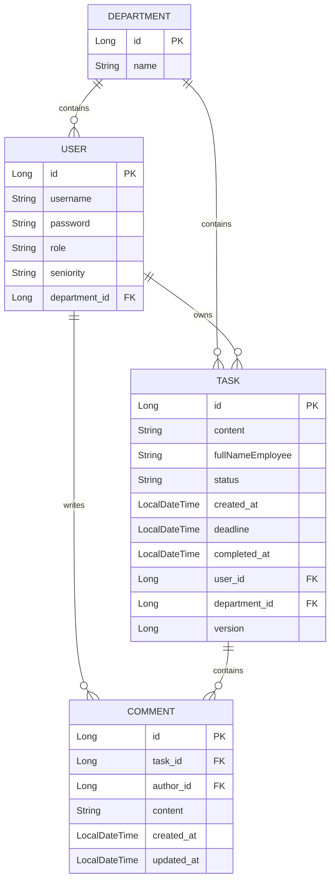

# Корпоративный Трекер Задач (Task Tracker)

[](https://github.com/GeTQuer/MySpringProject/actions/workflows/ci.yml)

Система управления задачами для сотрудников, менеджеров и отделов с ролевым
доступом, защитой от конкурентных изменений и наблюдаемостью. Ядро реализовано
как Spring Boot-приложение с frontend на Vanilla JavaScript, а уведомления
вынесены в отдельный Spring Boot-сервис, взаимодействующий с ядром через Kafka.

📸 Интерфейс

Авторизация


Список задач


Список задач если их много


Центр уведомлений

<!-- Добавьте сюда скриншот выпадающего центра уведомлений. -->


## 🎯 Что реализовано

- JWT-аутентификация, регистрация пользователей и BCrypt-хеширование паролей.
- Роли `USER`, `MANAGER`, `ADMIN` и объектные правила доступа через `TaskAccessPolicy`.
- CRUD, фильтрация и пагинация задач, комментарии и автоматическая обработка просроченных задач.
- Защита от lost update через optimistic locking (`@Version`) для обновления и удаления.
- DTO, Jakarta Validation и централизованная обработка ошибок, включая `409 Conflict`.
- Решение N+1 при пагинации: страница идентификаторов и отдельная загрузка данных через `JOIN FETCH`.
- Версионирование схемы PostgreSQL через Flyway и проверка mappings через `ddl-auto=validate`.
- Redis cache для ответов AI-функции, разбивающей задачу на подзадачи.
- Персональные уведомления в отдельном сервисе со своей PostgreSQL: счётчик непрочитанных, чтение одного или всех уведомлений, периодическое обновление и переход к связанной задаче.
- Надёжная доставка событий назначения через transactional outbox, Kafka и идемпотентный consumer по `event_id`.
- Swagger/OpenAPI для тестирования и документирования REST API.
- Actuator, Micrometer, Prometheus и Grafana для мониторинга приложения.
- GitHub Actions: сборка, тесты и проверка Flyway migrations на PostgreSQL.

## 🔒 Безопасность и изоляция данных

- Username берётся из `SecurityContext`, а не из данных, которым может управлять клиент.
- `@PreAuthorize` ограничивает endpoints по ролям, а `TaskAccessPolicy` проверяет доступ к конкретной задаче: пользователь видит свои задачи, менеджер — задачи своего отдела, администратор — все.
- Repository-запросы дополнительно ограничивают выборку по владельцу и department, защищая API от подмены ID (IDOR).
- Controllers работают с DTO и не возвращают JPA entities напрямую.
- Initial admin создаётся Flyway-миграцией из environment placeholders; в Git не сохраняются открытый пароль и его hash.

## 🏗 Архитектура

Основная бизнес-логика остаётся в слоистом Spring Boot-приложении, а уведомления
выделены в автономный сервис со своей базой данных:

```text
Browser ──JWT──> Task Tracker API ──> PostgreSQL (tasks + outbox)
                         │
                         └── outbox publisher ──> Kafka: task-events
                                                     │
Browser ──JWT──> Notification API <───────────────────┘
                         │
                         └──> Notification PostgreSQL
```

Frontend-файлы находятся в `backend/src/main/resources/static`, REST API разделён по controllers, бизнес-сценарии и транзакционные границы находятся в services, а доступ к данным реализован через Spring Data JPA repositories.

При назначении задачи `TaskService` сохраняет задачу и событие в outbox в одной
транзакции. Планировщик публикует неподтверждённые события в Kafka, после чего
`notification-service` создаёт уведомление в собственной БД. Уникальный
`event_id` делает повторную доставку безопасной. Frontend обращается к сервису
на порту `8081`, показывает toast и позволяет перейти к связанной задаче.

```text
TaskService → outbox_events → OutboxScheduler → Kafka task-events
    → TaskAssignedEventConsumer → notifications → Notification REST API
```

## Структура проекта

```text
backend/src/main/java/com/getquer/tasktracker
├── AI                 # Интеграция Spring AI и кеширование ответов
├── config             # Swagger и GlobalExceptionHandler
├── controllers        # REST-контроллеры
├── Entities           # JPA-сущности
├── Enums              # Статусы задач и пользователей
├── Repositories       # JpaRepository и кастомные запросы
├── requestDTO         # Валидируемые DTO для входящих данных
├── responseDTO        # DTO для безопасной отправки ответов
├── security           # JWT, Spring Security и TaskAccessPolicy
└── service            # Бизнес-логика и транзакционные границы

notification-service/src/main/java/com/getquer/notification
├── TaskAssignedEventConsumer  # Kafka consumer
├── NotificationService        # Чтение и изменение уведомлений
├── NotificationController     # Защищённый REST API
└── JwtAuthenticationFilter    # Проверка JWT, выпущенного Task Tracker
```

## Схема БД



Таблица `notifications` находится в отдельной БД `notification-service`.
Поля `recipient_id`, `actor_id` и `task_id` являются логическими ссылками на
данные Task Tracker: внешних ключей между разными базами нет. В БД ядра остаётся
`outbox_events`, обеспечивающая надёжную публикацию событий.

## 🛠 Стек технологий

### Backend

- Java 21
- Spring Boot (Web, Data JPA, Security, AI)
- PostgreSQL
- Hibernate
- Maven
- Redis
- Apache Kafka и transactional outbox
- Flyway
- Spring Boot Actuator и Micrometer
- Prometheus и Grafana
- JUnit 5 и Mockito
- Docker и Docker Compose
- GitHub Actions

### Frontend

- HTML5
- CSS3
- Bootstrap 5
- Vanilla JavaScript (Fetch API)

## 🚀 Запуск через Docker Compose

Требуется Docker Desktop с поддержкой Docker Compose.

1. Склонируйте репозиторий:

   ```bash
   git clone https://github.com/GeTQuer/MySpringProject.git
   cd MySpringProject
   ```

2. Создайте в корне файл `.env` (он исключён из Git):

   ```dotenv
   DB_NAME=tasktracker
   DB_USERNAME=your_user
   DB_PASSWORD=your_password
   DB_PORT=5432
   GEMINI_API_KEY=your_api_key
   ADMIN_USERNAME=admin
   ADMIN_PASSWORD_HASH=your_bcrypt_hash
   JWT_SECRET=replace_with_a_long_random_secret
   NOTIFICATION_DB_NAME=notifications
   NOTIFICATION_DB_USERNAME=notifications
   NOTIFICATION_DB_PASSWORD=your_notification_db_password
   CORS_ALLOWED_ORIGINS=http://localhost:8080,http://127.0.0.1:8080
   GRAFANA_ADMIN_USER=admin
   GRAFANA_ADMIN_PASSWORD=your_grafana_password
   ```

3. Соберите и запустите сервисы:

   ```bash
   docker compose up --build -d
   docker compose ps
   ```

4. Для остановки выполните:

   ```bash
   docker compose down
   ```

Команда `docker compose down -v` дополнительно удалит данные обеих PostgreSQL,
Prometheus и Grafana.

## 🔭 Мониторинг

После запуска Compose доступны:

| Компонент | Адрес | Назначение |
|---|---|---|
| Actuator Health | http://localhost:8080/actuator/health | Состояние Spring Boot приложения |
| Prometheus metrics | http://localhost:8080/actuator/prometheus | Метрики в формате Prometheus |
| Notification Health | http://localhost:8081/actuator/health | Состояние сервиса уведомлений |
| Notification metrics | http://localhost:8081/actuator/prometheus | Метрики сервиса уведомлений |
| Prometheus | http://localhost:9090 | Запросы PromQL и состояние target |
| Grafana | http://localhost:3000 | Dashboards и визуализация |

Prometheus получает метрики с `app:8080` и `notification-service:8081` внутри
сети Compose. Для ручного подключения Grafana добавьте data source типа
Prometheus с URL `http://prometheus:9090`; логин и пароль Grafana берутся из
`.env`.

Проверка target в Prometheus:

```promql
up{job="task-tracker"}
up{job="notification-service"}
```

Значение `1` означает, что Prometheus успешно получает метрики приложения.

## 🧪 Тесты и CI

Локальная проверка backend:

```bash
cd backend
./mvnw clean verify

cd ../notification-service
./mvnw clean verify
```

Workflow [Java CI with Maven and PostgreSQL](https://github.com/GeTQuer/MySpringProject/actions/workflows/ci.yml)
запускается для pull requests и изменений в `master/main`. Один required status
check `build-and-test` проверяет Flyway-миграции и тесты Task Tracker, а затем
собирает и тестирует notification-service.

## 📄 API и интерфейс

- Интерфейс: http://localhost:8080/login
- Swagger UI: http://localhost:8080/swagger-ui/index.html
- OpenAPI JSON: http://localhost:8080/v3/api-docs

### Уведомления

Все endpoints доступны только аутентифицированному пользователю и работают с его собственными уведомлениями:

| Метод | Endpoint | Назначение |
|---|---|---|
| `GET` | `http://localhost:8081/api/notifications?page=0&size=20` | Получить страницу уведомлений |
| `GET` | `http://localhost:8081/api/notifications/unread-count` | Получить количество непрочитанных |
| `PATCH` | `http://localhost:8081/api/notifications/{id}/read` | Отметить одно уведомление прочитанным |
| `PATCH` | `http://localhost:8081/api/notifications/read-all` | Отметить все уведомления прочитанными |

Центр уведомлений встроен в страницу задач и административную панель. Он
обновляется автоматически, показывает toast для новых назначений и подсвечивает
связанную задачу после перехода. При клике frontend отправляет `PATCH` в
notification-service; признак прочтения хранится как время в поле `read_at`.
